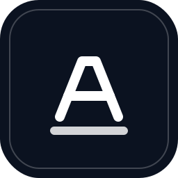
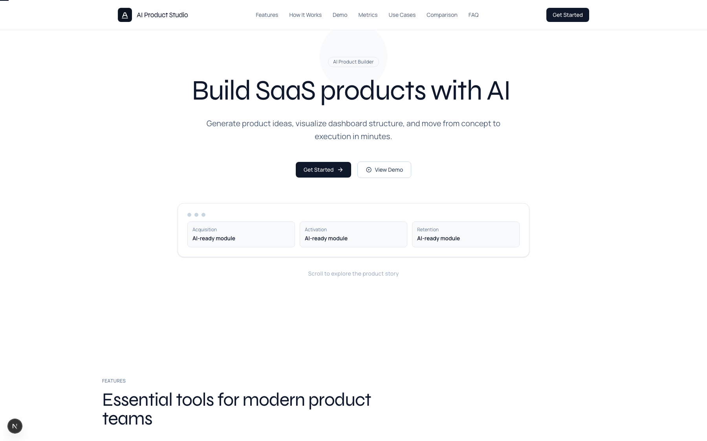
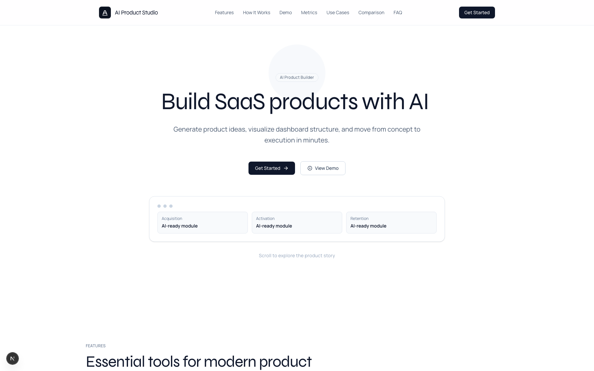
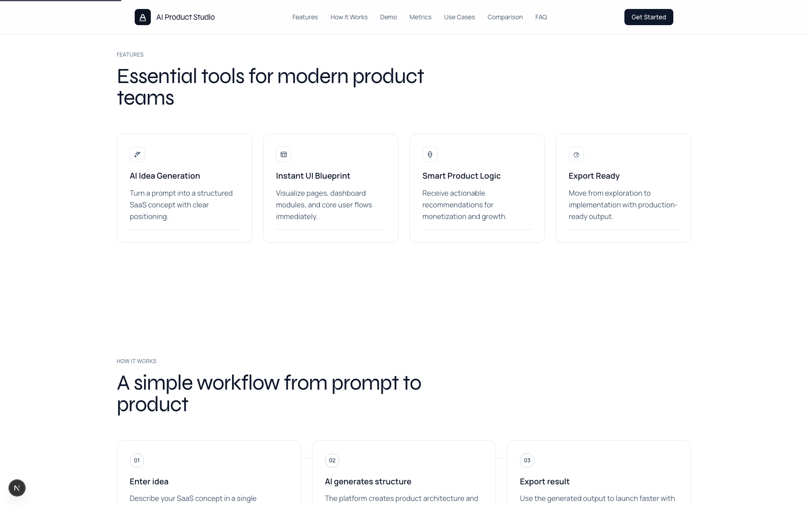
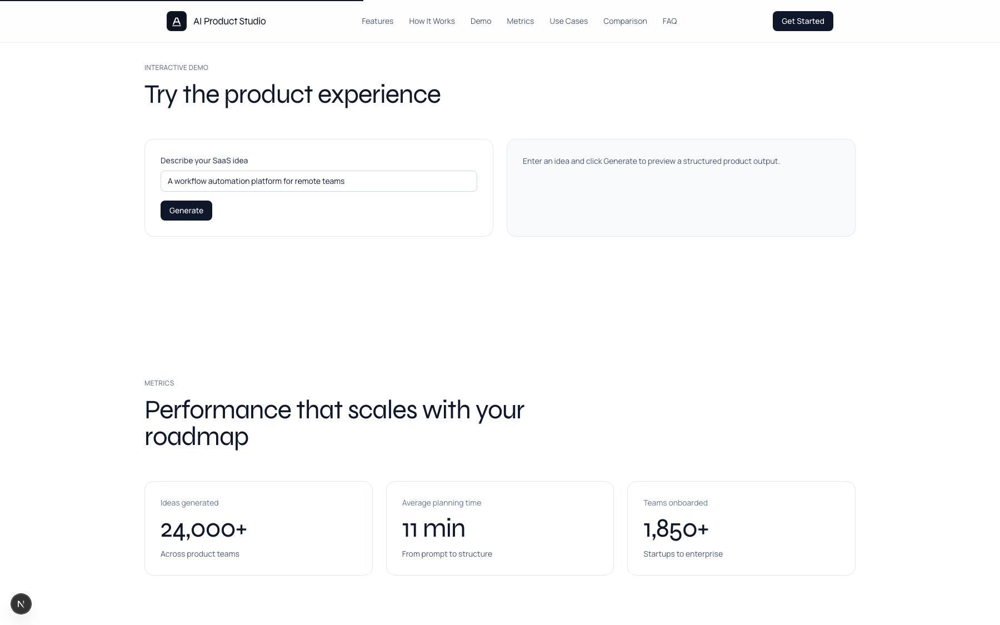
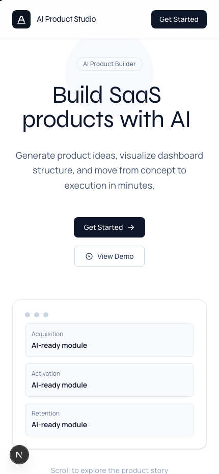
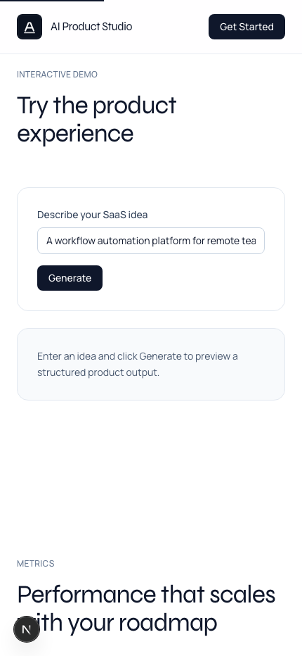
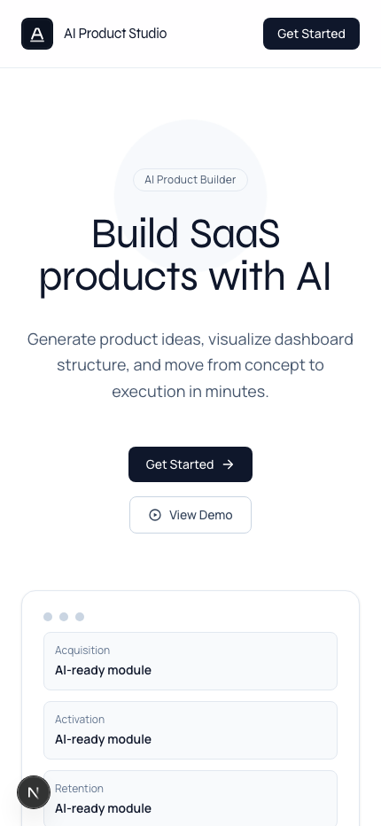

<p align="center">
  
</p>

<h1 align="center">AI Product Studio Landing Page</h1>

<p align="center">
  A premium, futuristic SaaS-style landing experience built with modern frontend tooling.
</p>

<p align="center">
  This project focuses on conversion-first storytelling, high-end visual polish, and responsive interaction design.
</p>

<p align="center">
  
  
  
  
  
</p>

---

## Hero Preview



---

## Table of Contents

- [Project Overview](#project-overview)
- [Screenshot Gallery](#screenshot-gallery)
- [Tech Stack](#tech-stack)
- [Landing Page Structure](#landing-page-structure)
- [Motion and Interaction Strategy](#motion-and-interaction-strategy)
- [Codebase Structure](#codebase-structure)
- [Design System Notes](#design-system-notes)
- [Local Development](#local-development)
- [NPM Scripts](#npm-scripts)
- [How to Customize](#how-to-customize)
- [Implementation Notes](#implementation-notes)

---

## Project Overview

This repository contains a complete marketing landing page for an AI product concept called **AI Product Studio**.

The page is intentionally designed as a premium one-page experience:

- bold hero storytelling with animated typography;
- cinematic backgrounds and glassmorphism surfaces;
- interactive product demo simulation;
- dashboard-style data storytelling;
- pricing and final conversion-focused call-to-action.

Every section is built as a reusable React component, making the project easy to maintain and extend.

---

## Screenshot Gallery

### Full Landing View



### Desktop Screens

<p>
  
  
</p>

<p>
  
  
</p>

### Mobile Screens

<p>
  
  
  
</p>

---

## Tech Stack

| Layer | Technologies |
| --- | --- |
| Framework | `Next.js 16` (App Router) |
| UI Runtime | `React 19` |
| Language | `TypeScript` |
| Styling | `Tailwind CSS v4` + custom global CSS variables |
| Animation | `Framer Motion` |
| Icons | `lucide-react` |
| Fonts | `next/font` (Manrope + Syne) |

---

## Landing Page Structure

### 1. Hero Section (`HeroSection.tsx`)

- Animated headline sequence with highlighted gradient words.
- CTA pair for primary conversion and secondary exploration.
- Floating “Neural Core” visual module with progress bars.
- Trust/impact metrics directly in hero for immediate context.

### 2. Features Section (`FeaturesSection.tsx`)

- Capability cards with icon-first communication.
- Subtle 3D-hover behavior for premium interaction feedback.
- Structured copy to explain value quickly.

### 3. Interactive Demo Section (`InteractiveDemoSection.tsx`)

- Input prompt with smart suggestion chips.
- Simulated generation pipeline (`idle -> thinking -> ready`).
- Progressive output rendering with loading states.
- Mini analytics preview generated as part of the demo flow.

### 4. Dashboard Preview Section (`DashboardPreviewSection.tsx`)

- Animated chart bars and conversion funnel indicators.
- Data blocks designed to feel like product telemetry.
- Team highlights module for additional narrative depth.

### 5. Pricing Section (`PricingSection.tsx`)

- Three-plan pricing layout.
- Visual emphasis on the most strategic middle plan.
- Feature checklist with strong scanability.

### 6. Final CTA Section (`FinalCtaSection.tsx`)

- Closing conversion block with high contrast visual treatment.
- Final magnetic CTA for stronger interaction affordance.

---

## Motion and Interaction Strategy

The interaction model is designed to balance visual impact with clarity:

- staggered text/section entrances;
- scroll-reveal transitions for content rhythm;
- hover elevation and slight perspective transforms;
- custom cursor and magnetic button behavior;
- ambient animated background layers;
- chart and progress micro-animations that reinforce product feel.

All motion values are tuned to feel polished without sacrificing readability or speed.

---

## Codebase Structure

```text
app/
  globals.css
  layout.tsx
  page.tsx

components/
  landing/
    AnimatedBackground.tsx
    CustomCursor.tsx
    DashboardPreviewSection.tsx
    FeaturesSection.tsx
    FinalCtaSection.tsx
    HeroSection.tsx
    InteractiveDemoSection.tsx
    LandingPage.tsx
    MagneticButton.tsx
    PricingSection.tsx
    SectionReveal.tsx

assets/
  readme/
    screens/
```

- `public/icon.svg`

---

## Design System Notes

Global tokens and reusable styling primitives are centralized in:

- `app/globals.css`

Typography setup and metadata configuration live in:

- `app/layout.tsx`

---

## Local Development

1. Install dependencies:

```bash
npm install
```

2. Run the development server:

```bash
npm run dev
```

Open [http://localhost:3000](http://localhost:3000) in your browser.

---

## NPM Scripts

- `npm run dev` - run local development server
- `npm run build` - create production build
- `npm run start` - run production server
- `npm run lint` - run ESLint checks

---

## How to Customize

### Branding

- Replace `public/icon.svg` with your own favicon/logo artwork.
- Update title, description, and social metadata in `app/layout.tsx`.

### Content

- Edit all section copy in `components/landing/*`.
- Update feature cards, pricing plans, and CTA labels directly in component data arrays.

### Visual Style

- Adjust global color tokens and gradients in `app/globals.css`.
- Fine-tune easing, duration, and delay values in Framer Motion props.

### Structure

- Add new sections as components in `components/landing`.
- Mount them in `LandingPage.tsx` in your preferred page order.

---

## Implementation Notes

- Built as a client-rich UI intentionally optimized for visual storytelling.
- Uses reusable section wrappers (`SectionReveal`) for consistent reveal behavior.
- Designed to be easy to fork into product sites, startup pages, or portfolio homepages.

---

<p align="center">
  Designed for bold product storytelling and strong first impressions.
</p>
