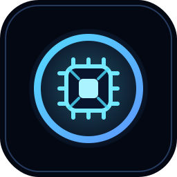
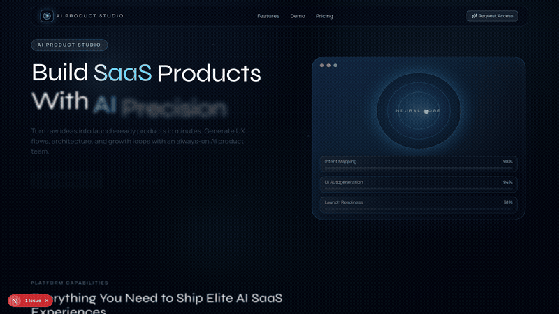
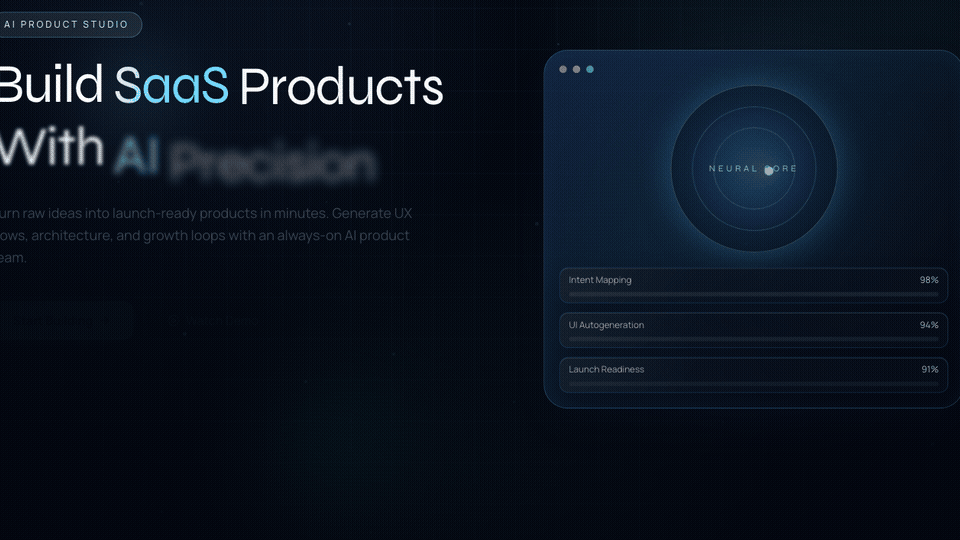
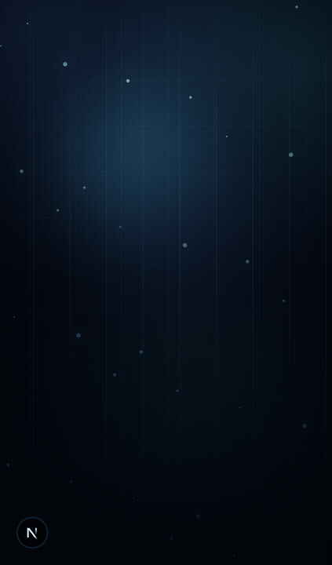

<p align="center">
  
</p>

<h1 align="center">AI Product Studio Landing Page</h1>

<p align="center">
  Стильный футуристичный SaaS-лендинг с акцентом на motion-дизайн, glassmorphism и интерактивные UI-блоки.
</p>

<p align="center">
  
  
  
  
  
</p>

## Preview



<p>
  
  
</p>

## О проекте

Этот проект демонстрирует визуально насыщенный landing page для AI-продукта:

- сильный первый экран с анимированным hero-блоком;
- карточки возможностей платформы;
- интерактивная demo-секция с имитацией AI generation;
- dashboard preview с анимированными графиками;
- pricing-блок и финальный CTA.

## Технологический стек

- `Next.js 16` (App Router)
- `React 19`
- `TypeScript`
- `Tailwind CSS 4`
- `Framer Motion`
- `lucide-react` (иконки)

## Что использовано в лендинге

- секционная архитектура на переиспользуемых компонентах в `components/landing`;
- плавные reveal-анимации и микро-взаимодействия;
- кастомный курсор и magnetic button-эффекты;
- glassmorphism-стиль, градиенты и glow-элементы;
- адаптивная верстка для desktop и mobile.

## Запуск локально

```bash
npm install
npm run dev
```

Откройте: [http://localhost:3000](http://localhost:3000)

## Скрипты

- `npm run dev` - запуск dev-сервера
- `npm run build` - production-сборка
- `npm run start` - запуск production-версии
- `npm run lint` - проверка ESLint

## Структура проекта

```text
app/
  layout.tsx
  page.tsx
  icon.svg
components/
  landing/
assets/
  readme/
```
